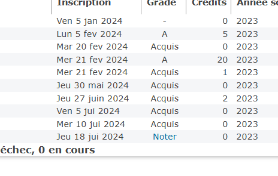
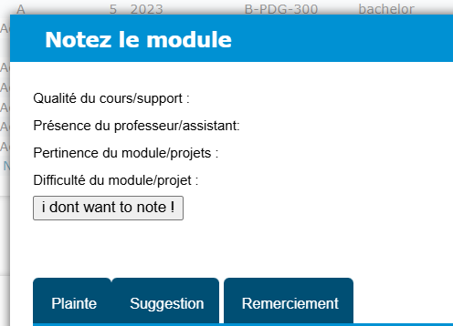

# i dont wanna note
ONLY FOR EPITECH STUDENTS - on the intra, you dont wanna note to get your grade too ?

Behold: idontwannanote ! an extension that adds a button to make a random notation

1. Clone the repo
2. Install the extension (in `brave://extensions` or `chrome://extensions`, then use developper mode to load unpack the repository path)
3. Go to https://intra.epitech.eu/user/#!/notes and click on "Noter" somewhere on a project you didnt note already.

4. You should have the little button that can select notes for you !

